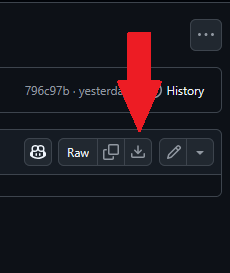
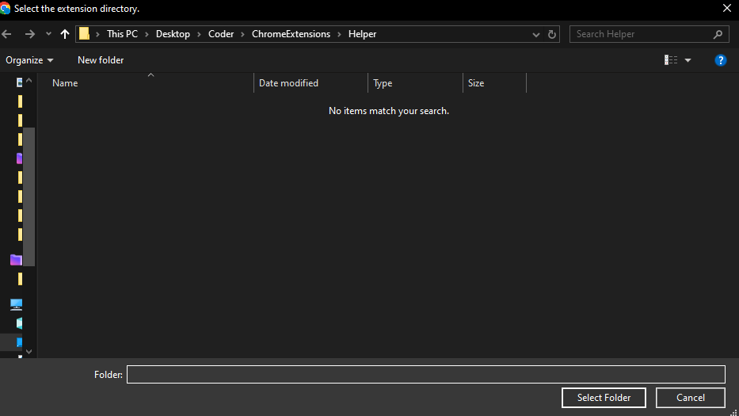

# Coaches Directory helper

## What is it?

## Setup

This extension works for both **Google Chrome** as well as **Microsoft Edge**. The installation process almost identical for both browsers.

*This does not work on Firefox, additionally it has not been tested for other browsers.*

#### Download Zip file
Download the zip file for the extension [here](https://github.com/hsmith56/CoachDirExtension/raw/refs/heads/main/Helper.zip). Alternatively, you can choose to manually download the zip file by clicking on the zip file above, and then locating and clicking the `download raw file` 

Unzip the file and delete the zip file, then move onto the next steps.

#### **Chrome**
1. Open up Chrome and type `chrome://extensions/` into the search bar as if it is a regular website URL and hit enter 
2. In the top right hand side of the screen, locate and select `Developer Mode` so that it is ticked blue
3. Select the `Load unpacked` button that is now present in the top left corner of the screen. 
4. Navigate to the location where you unzipped the file, and select the folder named `Helper`. It should look like the screenshot below. Hit Select Folder.
5. You should now see that the extension has been added to your browser.

#### **Microsoft Edge**

1. Open up Edge and type `edge://extensions/` into the search bar as if it is a regular website URL and hit enter 
2. In the left hand side of the screen, locate and select `Developer Mode` so that it is ticked blue
3. Select the `Load unpacked` button that is now present in the top middle section of the screen. 
4. Navigate to the location where you unzipped the file, and select the folder named `Helper`. It should look like the screenshot below. Hit Select Folder.
5. You should now see that the extension has been added to your browser.

## How to use it?
